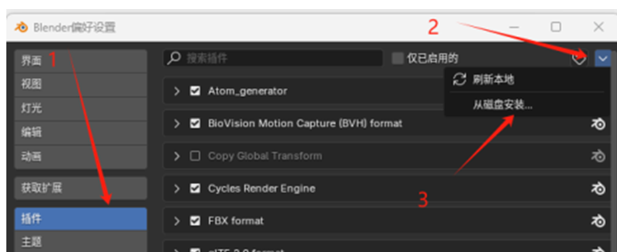
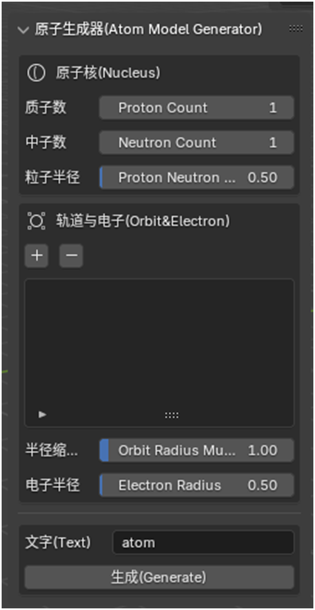

# 原子生成器使用指引

## 概述

本指南提供了关于如何使用原子生成器插件的详细说明。通过此插件，您可以在 **Blender** 中创建自定义的原子模型。

## 前置条件

从Release中下载以下文件：
   - 插件安装包 `AtomGenerator.zip`

---

## 安装插件

1. 打开 **Blender** 主界面。
2. 依次选择：**编辑 -> 偏好设置**。
3. 在偏好设置中：
   - 选择 **插件** 选项卡。
   - 单击右上角的 **箭头**，选择 **从磁盘安装**。
   - 找到 `AtomGenerator.zip` 文件并点击安装。
4. 安装完成后，返回3D视图：
   - 按下 **N 键**。
   - 在右侧工具栏中选择 **Atom Tool** 选项卡，出现原子生成器。

---

## 使用说明

### 创建材质
- 在生成原子前，请确保场景内包含以下四种材质：
`orbit_material`、`electron_material`、`proton_material`、`neutron_material`

### 参数说明

- **质子数**：设置元素的质子数。
- **中子数**：设置元素的中子数。
- **粒子半径**：调整质子和中子的粒子大小。
- **轨道与电子**：
  - **新增轨道**：按下 “+” 新增一个轨道。
  - **电子组数**：设置每个轨道上的电子组数。
  - **每组电子数**：设置每组电子的数量。
- **半径缩放系数**：控制轨道的缩放程度。
- **电子半径**：调整电子的粒子大小。
- **文字**：为质子和中子生成前方文字标记。
- **生成**：删除场景中的所有模型并生成新的原子模型。

---

## 模型导出

**注意事项**：
- 如果你希望在导出动画时将每个电子的动画合并导出，在导出的动画设置中，确保取消勾选 **NLA片段** 和 **全部动作**。

---

